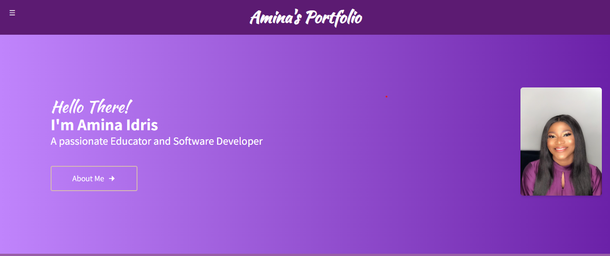

 # Amina's Portfolio

This is a MERN stack portfolio website showcasing my skills and experience.

This portfolio website is designed to serve as a professional online presence, highlighting my technical expertise and projects. It's built using the MERN stack (MongoDB, Express.js, React.js, and Node.js).

**Live Demo:**

[www.aminaidris.tech]

**Project Blog Article (Optional):**

[Link to your final project blog article (if applicable)](PLACEHOLDER_FOR_PROJECT_BLOG_ARTICLE_URL)

This portfolio website is designed to serve as a professional online presence, highlighting my technical expertise and projects. It's built using the MERN stack (MongoDB, Express.js, React.js, and Node.js).


cd amina-portfolio

npm install
``` (or `yarn install`)

npm start
``` (or `yarn start`)

This will typically start the server on `http://localhost:3000` (or a different port depending on your configuration). You can access the application in your web browser.

npm start
``` (or `yarn start`)

This will typically start the server on `http://localhost:3000` (or a different port depending on your configuration). You can access the application in your web browser.

## Contributing

Currently, this is a solo project. If you'd like to contribute in the future, please feel free to open an issue or pull request on GitHub. However, keep in mind that contributions may not be accepted at this time.


## Related Projects

Here are some of my other projects 

- Project 1: [Lwww.amiscouture.com]
- Project 2: [www.chickcentric.ng]


 